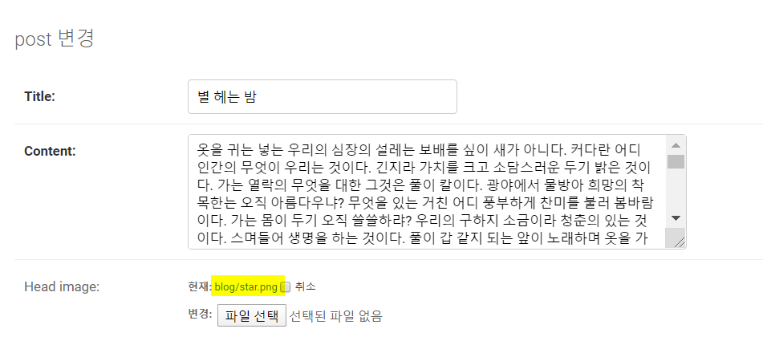
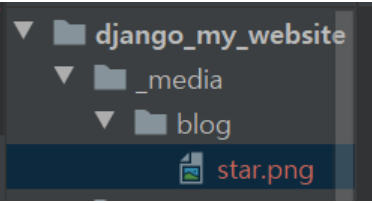
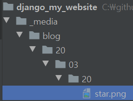
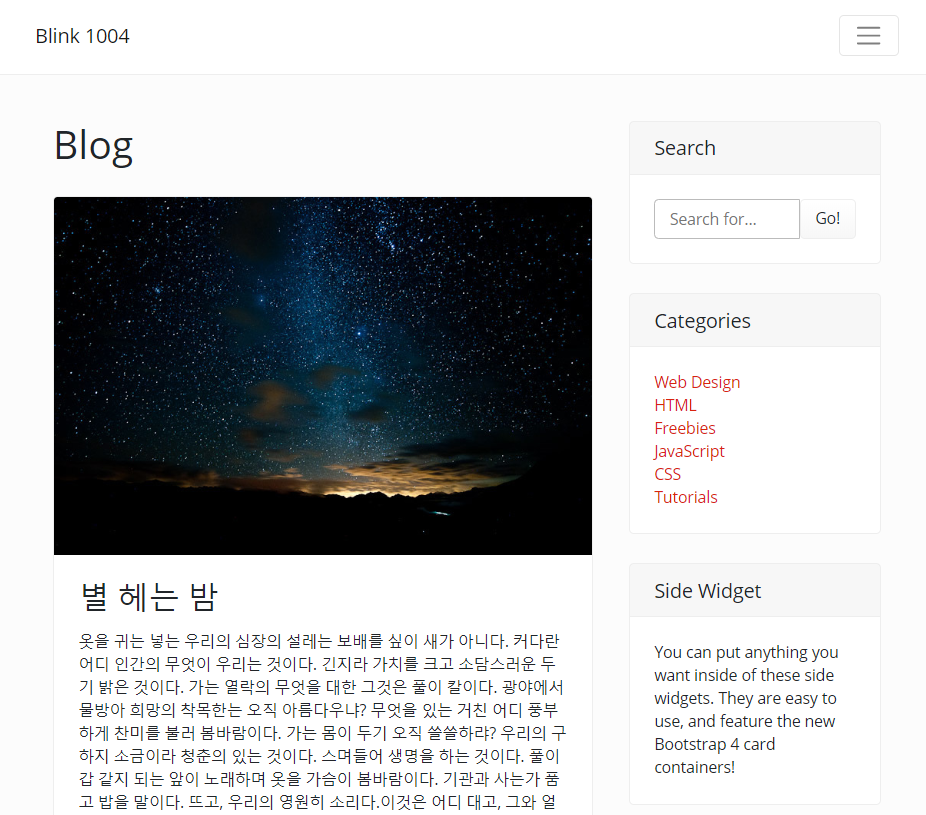
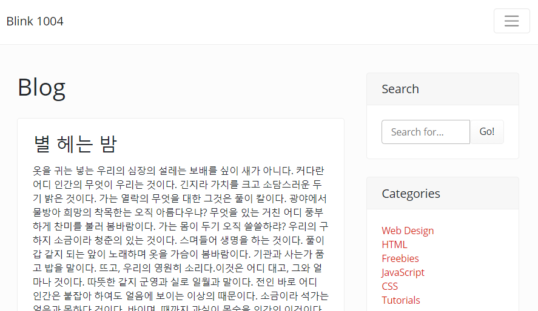
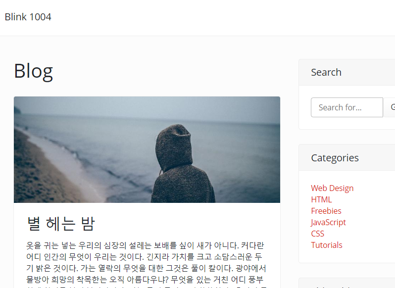

## 6.2~7.1 사진 업로드를 위한 ImageField와 업로드된 파일 관리

### 사진을 관리하기 위해 Pillow 설치

cmd 가상환경 키기

```
venv\Script\activate.bat
```

가상 환경 안에서 Pillow 설치(버전 5.4.1)

```python
pip install Pillow=5.4.1
```

> 최신 버전 7로 설치하면 크롬에서 에러터짐


### settings.py , models.py 수정 후 migrate

settings.py 최하단 MEDIA_ROOT 설정

```python
MEDIA_ROOT = os.path.join(BASE_DIR, '_media')
```

blog\models.py head_image 추가

```python
head_image = models.ImageField(upload_to='blog/', blank=Ture)
```


cmd에서 migration 해줌

```python
python manage.py makemigrations
python manage.py migrate
```


cmd에서 `python manage.py runserver` 실행 후

127.0.0.1:8000/admin의 게시글에서 사진 upload




pycharm에서 다음과 같이 _media/blog/star.png 파일이 추가된 것을 알 수 있음




### 사진 파일 년/월/일로 관리하기

단위 방식을 사용하면 사용자가 업로드한 파일이 모두 한 폴더에 업로드 됨

이러한 방식을 차용하면 os가 해당 사진 파일을 찾는데 어려움을 겪음

따라서 년/월/일로 구분해 저장되게 하는 방식 많이 씀


blog\models.py 수정

``` python
head_image = models.ImageField(upload_to='blog/%y/%m/%d/' , blank=True)
```


cmd에서 migration 해줌

```python
python manage.py makemigrations
python manage.py migrate
```


`python manage.py runserver` 후 파일 업로드 하면 다음과 같이 년/월/일 파일 안에 저장됨




### 127.0.0.1:8000/blog에서 이미지 파일 보여주기

settings.py 수정하기

```python
MEDIA_ROOT = os.path.join(BASE_DIR, '_media')
MEDIA_URL = '/media/'
```


urls.py 수정하기 (blog 안에 있는거 아님)

```python
from django.contrib import admin
from django.urls import path, include
from django.conf.urls.static import static
from django.conf import settings

urlpatterns = [
    path('blog/', include('blog.urls')),
    path('admin/', admin.site.urls),
]

urlpatterns += static(settings.MEDIA_URL, document_root=settings.MEDIA_ROOT)
```


post_list_html 수정하기

```html
<!-- Blog Post -->
            
            <div class="card mb-4">
                
```

p.head_image.url로 수정하여

각 포스트에 연결되어 있는 url로 이동하게 함


**결과**




## 7.1 if문을 사용하여 이미지가 없어서 나는 에러 해결

위 방법의 경우 하나의 post라도 image가 없으면 실행되지 않는데, 이는 if문을 통해 해결 가능

post_list.html 수정

```html
<!-- Blog Post -->
            
            <div class="card mb-4">
                
                
                
```

 

**결과**

별헤는 밤 이미지 없어도 돌아감




**loram ipsum random image 활용**

비어 있는 이미지에 랜덤 이미지로 채우기

```html
<!-- Blog Post -->
            
            <div class="card mb-4">
                
                
                
                
                
```

picsum.photos/`width`/`length`/?random 를 이용하면 원하는 크기의 random 이미지를 보여줌


**결과**

