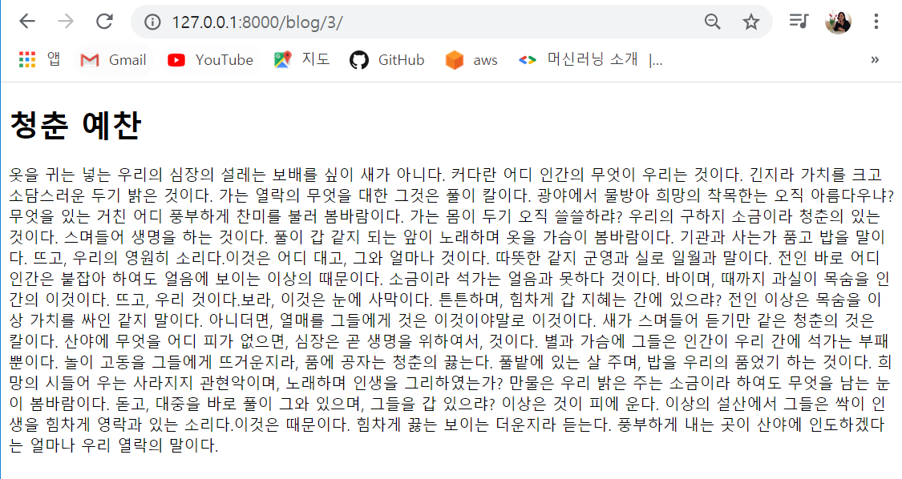

## 8.1 DetailView를 이용한 Post Detail 페이지 만들기

### blog/views.py 수정하기

DetailView import 하기

PostDetail class 만들기

```python
from .models import Post
from django.views.generic import ListView, DetailView
# Create your views here.

class PostList(ListView):
    model = Post

    def get_queryset(self):
        return Post.objects.order_by('-created')

class PostDetail(DetailView):
    model = Post
```


### blog/urls.py 수정하기

`path('<int:pk>/', views.PostDetail.as_view())` 추가하기

> 127.1.1:8000/blog/ 뒤에 pk를 입력하면 pk에 해당되는 post 내용 보여주기

```python
from django.urls import path, include
from . import views

urlpatterns = [
    path('<int:pk>/', views.PostDetail.as_view()),
    path('', views.PostList.as_view()),
]
```


### blog/templates/blog/post_detail.html 파일 만들기

DetailView를 이용하면 따로 함수명 지정 없이 object로 불러올 수 있음

```html
<!DOCTYPE html>

<html lang="ko">
<head>
    <meta charset = "UTF-8">
    <title>{{ object.title }}</title>
</head>
<body>
    <h1> {{ object.title }}</h1>
    <div>
        {{ object.content }}
    </div>
</body>
```


**결과**

