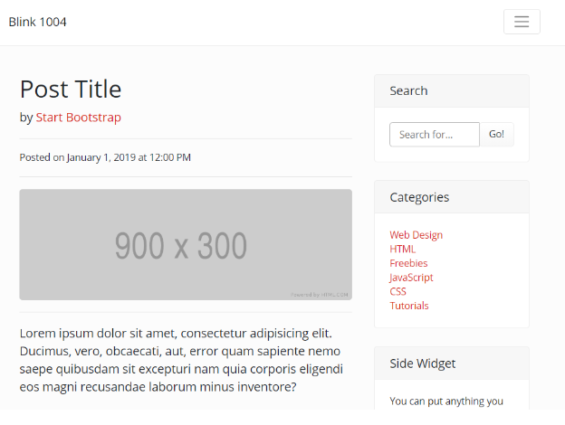
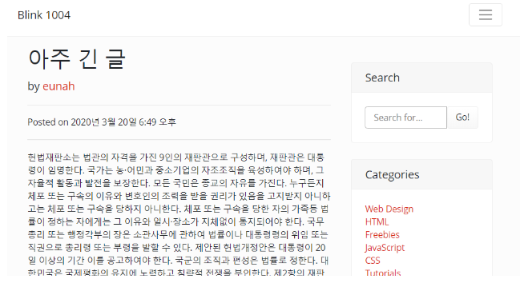

## 10.2 Read More 버튼 동작하게 하기

### post_list.html 수정하기

Read More 버튼에 연결되는 url과 id 만들어주기

url은 post의 absolute_url로, id는 "read-more-post-{{pk번호}}"로 지정

```html
<a href="{{ p.get_absolute_url }}" class="btn btn-primary" id="read-more-post-{{ p.pk }}">Read More &rarr;</a>
```


### test.py 수정하기

```python
    def test_post_list(self):
        response = self.client.get("/blog/")
        self.assertEqual(response.status_code, 200)

        soup = BeautifulSoup(response.content, 'html.parser')
        title = soup.title

        self.assertEqual(title.text, 'Blog')

        self.check_navbar(soup)

        self.assertEqual(Post.objects.count(), 0)
        self.assertIn('아직 게시물이 없습니다.', soup.body.text)

        post_000 = create_post(
            title='The first post',
            content='Hello World. We are the world.',
            author=self.author_000,
        )

        self.assertGreater(Post.objects.count(), 0)

        response = self.client.get("/blog/")
        self.assertEqual(response.status_code, 200)
        soup = BeautifulSoup(response.content, 'html.parser')
        body = soup.body
        self.assertNotIn('아직 게시물이 없습니다.', body.text)
        self.assertIn(post_000.title, body.text)

        post_000_read_more_btn = body.find('a', id='read-more-post-{}'.format(post_000.pk))
        self.assertEqual(post_000_read_more_btn['href'], post_000.get_absolute_url())

```

post_000_read_more_btn를 정의해주고

 post_000_read_more_btn['href']가 post_000.get_absolute_url()과 같은지 test


### detail.html 템플릿 수정

https://startbootstrap.com/previews/blog-post/ 해당 템플릿 이용

```html


{{ object.title }} - Blog



<!-- Post Content Column -->
<div class="col-lg-8">

    <!-- Title -->
    <h1 class="mt-4">Post Title</h1>

    <!-- Author -->
    <p class="lead">
        by
        <a href="#">Start Bootstrap</a>
    </p>

    <hr>

    <!-- Date/Time -->
    <p>Posted on January 1, 2019 at 12:00 PM</p>

    <hr>

    <!-- Preview Image -->
    

    <hr>

    <!-- Post Content -->
    <p class="lead">Lorem ipsum dolor sit amet, consectetur adipisicing elit. Ducimus, vero, obcaecati, aut, error quam sapiente nemo saepe quibusdam sit excepturi nam quia corporis eligendi eos magni recusandae laborum minus inventore?</p>

    <p>Lorem ipsum dolor sit amet, consectetur adipisicing elit. Ut, tenetur natus doloremque laborum quos iste ipsum rerum obcaecati impedit odit illo dolorum ab tempora nihil dicta earum fugiat. Temporibus, voluptatibus.</p>

    <p>Lorem ipsum dolor sit amet, consectetur adipisicing elit. Eos, doloribus, dolorem iusto blanditiis unde eius illum consequuntur neque dicta incidunt ullam ea hic porro optio ratione repellat perspiciatis. Enim, iure!</p>

    <blockquote class="blockquote">
        <p class="mb-0">Lorem ipsum dolor sit amet, consectetur adipiscing elit. Integer posuere erat a ante.</p>
        <footer class="blockquote-footer">Someone famous in
            <cite title="Source Title">Source Title</cite>
        </footer>
    </blockquote>

    <p>Lorem ipsum dolor sit amet, consectetur adipisicing elit. Error, nostrum, aliquid, animi, ut quas placeat totam sunt tempora commodi nihil ullam alias modi dicta saepe minima ab quo voluptatem obcaecati?</p>

    <p>Lorem ipsum dolor sit amet, consectetur adipisicing elit. Harum, dolor quis. Sunt, ut, explicabo, aliquam tenetur ratione tempore quidem voluptates cupiditate voluptas illo saepe quaerat numquam recusandae? Qui, necessitatibus, est!</p>

    <hr>

    <!-- Comments Form -->
    <div class="card my-4">
        <h5 class="card-header">Leave a Comment:</h5>
        <div class="card-body">
            <form>
                <div class="form-group">
                    <textarea class="form-control" rows="3"></textarea>
                </div>
                <button type="submit" class="btn btn-primary">Submit</button>
            </form>
        </div>
    </div>

    <!-- Single Comment -->
    <div class="media mb-4">
        
        <div class="media-body">
            <h5 class="mt-0">Commenter Name</h5>
            Cras sit amet nibh libero, in gravida nulla. Nulla vel metus scelerisque ante sollicitudin. Cras purus odio, vestibulum in vulputate at, tempus viverra turpis. Fusce condimentum nunc ac nisi vulputate fringilla. Donec lacinia congue felis in faucibus.
        </div>
    </div>

    <!-- Comment with nested comments -->
    <div class="media mb-4">
        
        <div class="media-body">
            <h5 class="mt-0">Commenter Name</h5>
            Cras sit amet nibh libero, in gravida nulla. Nulla vel metus scelerisque ante sollicitudin. Cras purus odio, vestibulum in vulputate at, tempus viverra turpis. Fusce condimentum nunc ac nisi vulputate fringilla. Donec lacinia congue felis in faucibus.

            <div class="media mt-4">
                
                <div class="media-body">
                    <h5 class="mt-0">Commenter Name</h5>
                    Cras sit amet nibh libero, in gravida nulla. Nulla vel metus scelerisque ante sollicitudin. Cras purus odio, vestibulum in vulputate at, tempus viverra turpis. Fusce condimentum nunc ac nisi vulputate fringilla. Donec lacinia congue felis in faucibus.
                </div>
            </div>

            <div class="media mt-4">
                
                <div class="media-body">
                    <h5 class="mt-0">Commenter Name</h5>
                    Cras sit amet nibh libero, in gravida nulla. Nulla vel metus scelerisque ante sollicitudin. Cras purus odio, vestibulum in vulputate at, tempus viverra turpis. Fusce condimentum nunc ac nisi vulputate fringilla. Donec lacinia congue felis in faucibus.
                </div>
            </div>

        </div>
    </div>
    
```

위 상태는 우리의 content 내용이 반영되지 않은 상태




아래와 같이 다시 수정

- object.title / object.author / object.create / object.content 반영
- Image가 있다면 이미지 넣는 것 for문을 사용
- comments form 이하는 댓글창이어서 손대지 X

```html


{{ object.title }} - Blog



<!-- Post Content Column -->
    <!-- Title -->
    <h1>{{ object.title }}</h1>

    <!-- Author -->
    <p class="lead">
        by
        <a href="#">{{ object.author.username }}</a>
    </p>

    <hr>

    <!-- Date/Time -->
    <p>Posted on {{ object.created }}</p>

    <hr>

    <!-- Preview Image -->
    
    
    

    <!-- Post Content -->
    {{ object.content }}

    <!-- Comments Form -->
    <div class="card my-4">
        <h5 class="card-header">Leave a Comment:</h5>
        <div class="card-body">
            <form>
                <div class="form-group">
                    <textarea class="form-control" rows="3"></textarea>
                </div>
                <button type="submit" class="btn btn-primary">Submit</button>
            </form>
        </div>
    </div>

    <!-- Single Comment -->
    <div class="media mb-4">
        
        <div class="media-body">
            <h5 class="mt-0">Commenter Name</h5>
            Cras sit amet nibh libero, in gravida nulla. Nulla vel metus scelerisque ante sollicitudin. Cras purus odio, vestibulum in vulputate at, tempus viverra turpis. Fusce condimentum nunc ac nisi vulputate fringilla. Donec lacinia congue felis in faucibus.
        </div>
    </div>

    <!-- Comment with nested comments -->
    <div class="media mb-4">
        
        <div class="media-body">
            <h5 class="mt-0">Commenter Name</h5>
            Cras sit amet nibh libero, in gravida nulla. Nulla vel metus scelerisque ante sollicitudin. Cras purus odio, vestibulum in vulputate at, tempus viverra turpis. Fusce condimentum nunc ac nisi vulputate fringilla. Donec lacinia congue felis in faucibus.

            <div class="media mt-4">
                
                <div class="media-body">
                    <h5 class="mt-0">Commenter Name</h5>
                    Cras sit amet nibh libero, in gravida nulla. Nulla vel metus scelerisque ante sollicitudin. Cras purus odio, vestibulum in vulputate at, tempus viverra turpis. Fusce condimentum nunc ac nisi vulputate fringilla. Donec lacinia congue felis in faucibus.
                </div>
            </div>

            <div class="media mt-4">
                
                <div class="media-body">
                    <h5 class="mt-0">Commenter Name</h5>
                    Cras sit amet nibh libero, in gravida nulla. Nulla vel metus scelerisque ante sollicitudin. Cras purus odio, vestibulum in vulputate at, tempus viverra turpis. Fusce condimentum nunc ac nisi vulputate fringilla. Donec lacinia congue felis in faucibus.
                </div>
            </div>

        </div>
    </div>
    
```

**결과**

