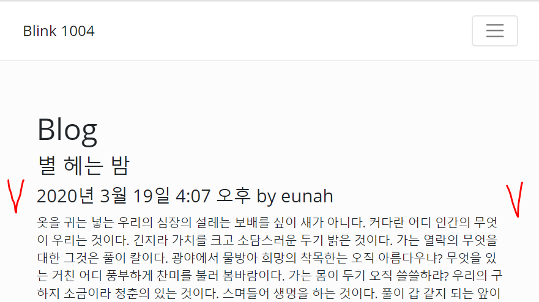
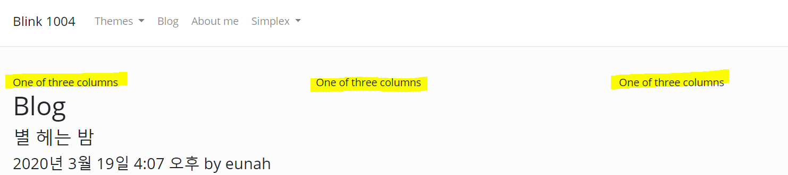
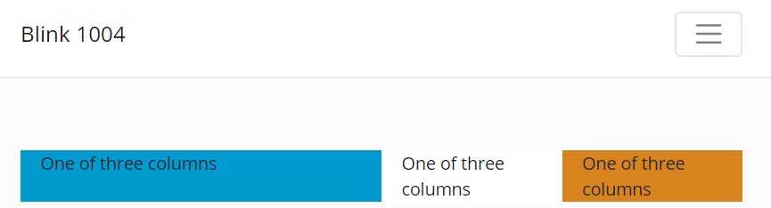
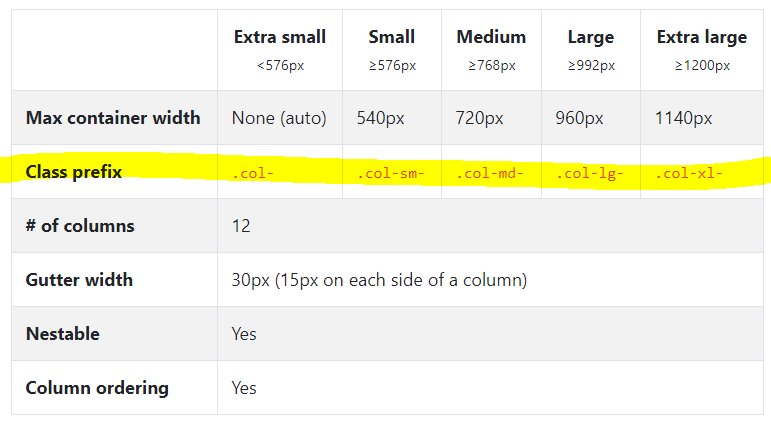
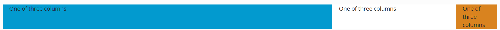
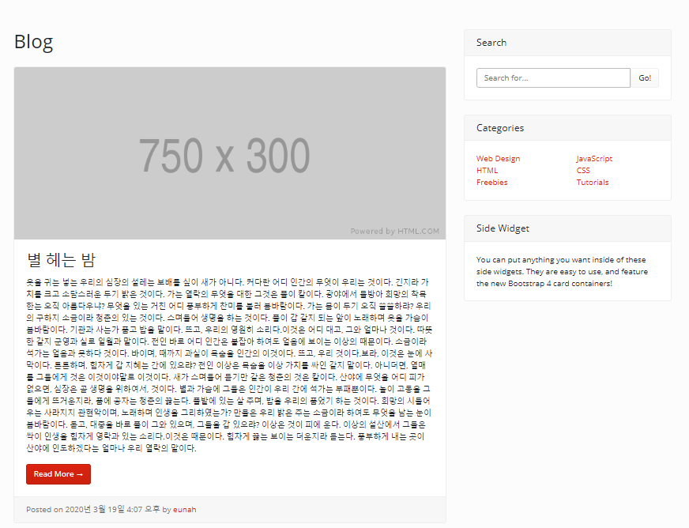

## 5. Bootstrap 적용

### 5.4 Bootstrap Grid

#### post_list.html

- div class = 'container'

```html
<div class="container">
    <h1>Blog</h1>

    
    <h3>{{ p.title }}</h3>
    <h4>{{ p.created }} by {{ p.author }}</h4>
    <p>{{ p.content }}</p>
    
</div>
```

`<div class="container">` 을 적용하게 되면 다음과 같이 text 내용 양 옆 여백이 생김




- Bootstrap Gird란?

  pc, labtop, mobile 화면의 크기에 맞춰서 자동적으로 화면이 바뀌는 것을 의미

  https://getbootstrap.com/docs/4.4/layout/grid/ 에서 해당 코드 복사

  ```html
  <div class="container">
    <div class="row">
      <div class="col-sm">
        One of three columns
      </div>
      <div class="col-sm">
        One of three columns
      </div>
      <div class="col-sm">
        One of three columns
      </div>
    </div>
  </div>
  ```

  세 개의 섹션으로 나눠진 것을 알 수 있음




​	첫번째 섹션의 크기를 6으로 두고 이를 가시적으로 보기 위해 색을 넣어봄

> 전체 비율은 12임

```html
<div class="container">
      <div class="row">
    <div class="col-sm-6 bg-info">
      One of three columns
    </div>
    <div class="col-sm bg-light">
      One of three columns
    </div>
    <div class="col-sm bg-danger">
      One of three columns
    </div>
  </div>
```




화면 크기에 따라 다른 명령어 사용



```html
<div class="container">
      <div class="row">
    <div class="col-md-8 bg-info">
      One of three columns
    </div>
    <div class="col-md-3 bg-light">
      One of three columns
    </div>
    <div class="col-md-1 bg-danger">
      One of three columns
    </div>
```




start bootstrap에서 블로그 껍데기 가져오기

[view-source:https://blackrockdigital.github.io/startbootstrap-blog-home/](view-source:https://blackrockdigital.github.io/startbootstrap-blog-home/)

` <div class="container"> ~~</div>` 코드 아래와 같이 바꿈

```html
<div class="container">

    <h1>Blog</h1>

    
    <h3>{{ p.title }}</h3>
    <h4>{{ p.created }} by {{ p.author }}</h4>
    <p>{{ p.content }}</p>
    

    <div class="row">

        <!-- Blog Entries Column -->
        <div class="col-md-8">

            <h1 class="my-4">Page Heading
                <small>Secondary Text</small>
            </h1>

            <!-- Blog Post -->
            <div class="card mb-4">
                
                <div class="card-body">
                    <h2 class="card-title">Post Title</h2>
                    <p class="card-text">Lorem ipsum dolor sit amet, consectetur adipisicing elit. Reiciendis aliquid atque, nulla? Quos cum ex quis soluta, a laboriosam. Dicta expedita corporis animi vero voluptate voluptatibus possimus, veniam magni quis!</p>
                    <a href="#" class="btn btn-primary">Read More &rarr;</a>
                </div>
                <div class="card-footer text-muted">
                    Posted on January 1, 2017 by
                    <a href="#">Start Bootstrap</a>
                </div>
            </div>

            <!-- Blog Post -->
            <div class="card mb-4">
                
                <div class="card-body">
                    <h2 class="card-title">Post Title</h2>
                    <p class="card-text">Lorem ipsum dolor sit amet, consectetur adipisicing elit. Reiciendis aliquid atque, nulla? Quos cum ex quis soluta, a laboriosam. Dicta expedita corporis animi vero voluptate voluptatibus possimus, veniam magni quis!</p>
                    <a href="#" class="btn btn-primary">Read More &rarr;</a>
                </div>
                <div class="card-footer text-muted">
                    Posted on January 1, 2017 by
                    <a href="#">Start Bootstrap</a>
                </div>
            </div>

            <!-- Blog Post -->
            <div class="card mb-4">
                
                <div class="card-body">
                    <h2 class="card-title">Post Title</h2>
                    <p class="card-text">Lorem ipsum dolor sit amet, consectetur adipisicing elit. Reiciendis aliquid atque, nulla? Quos cum ex quis soluta, a laboriosam. Dicta expedita corporis animi vero voluptate voluptatibus possimus, veniam magni quis!</p>
                    <a href="#" class="btn btn-primary">Read More &rarr;</a>
                </div>
                <div class="card-footer text-muted">
                    Posted on January 1, 2017 by
                    <a href="#">Start Bootstrap</a>
                </div>
            </div>

        </div>

        <!-- Sidebar Widgets Column -->
        <div class="col-md-4">

            <!-- Search Widget -->
            <div class="card my-4">
                <h5 class="card-header">Search</h5>
                <div class="card-body">
                    <div class="input-group">
                        <input type="text" class="form-control" placeholder="Search for...">
                        <span class="input-group-btn">
                <button class="btn btn-secondary" type="button">Go!</button>
              </span>
                    </div>
                </div>
            </div>

            <!-- Categories Widget -->
            <div class="card my-4">
                <h5 class="card-header">Categories</h5>
                <div class="card-body">
                    <div class="row">
                        <div class="col-lg-6">
                            <ul class="list-unstyled mb-0">
                                <li>
                                    <a href="#">Web Design</a>
                                </li>
                                <li>
                                    <a href="#">HTML</a>
                                </li>
                                <li>
                                    <a href="#">Freebies</a>
                                </li>
                            </ul>
                        </div>
                        <div class="col-lg-6">
                            <ul class="list-unstyled mb-0">
                                <li>
                                    <a href="#">JavaScript</a>
                                </li>
                                <li>
                                    <a href="#">CSS</a>
                                </li>
                                <li>
                                    <a href="#">Tutorials</a>
                                </li>
                            </ul>
                        </div>
                    </div>
                </div>
            </div>

            <!-- Side Widget -->
            <div class="card my-4">
                <h5 class="card-header">Side Widget</h5>
                <div class="card-body">
                    You can put anything you want inside of these side widgets. They are easy to use, and feature the new Bootstrap 4 card containers!
                </div>
            </div>

        </div>

    </div>
    <!-- /.row -->

</div>
```


위 코드 중 blog post를 for문을 이용하여 수정

```html
<!-- Blog Post -->
            
            <div class="card mb-4">
                
                <div class="card-body">
                    <h2 class="card-title">{{ p.title }}</h2>
                    <p class="card-text">{{ p.content }}</p>
                    <a href="#" class="btn btn-primary">Read More &rarr;</a>
                </div>
                <div class="card-footer text-muted">
                    Posted on {{ p.created }} by
                    <a href="#">{{ p.author }}</a>
                </div>
            </div>
            
```


결과값

